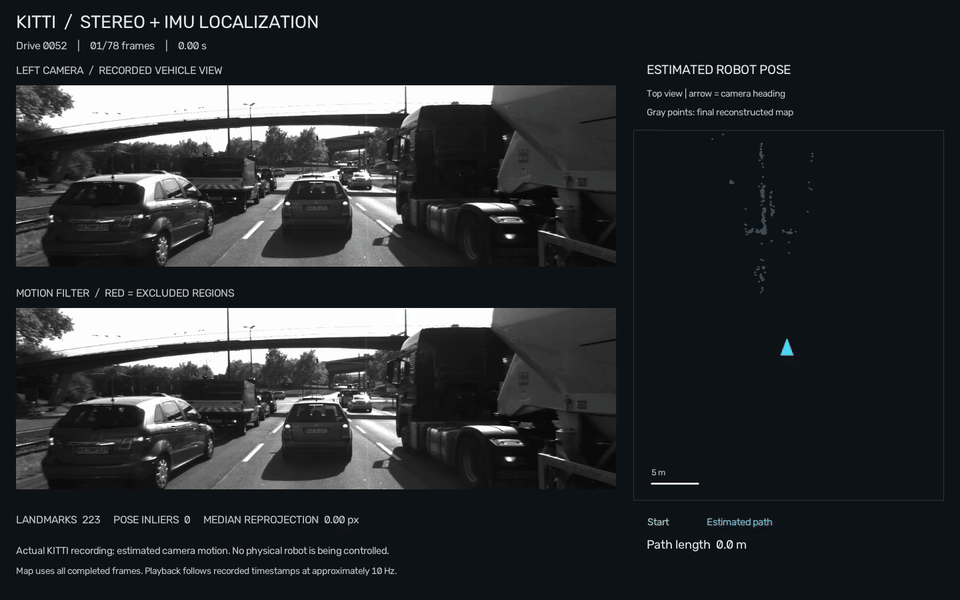
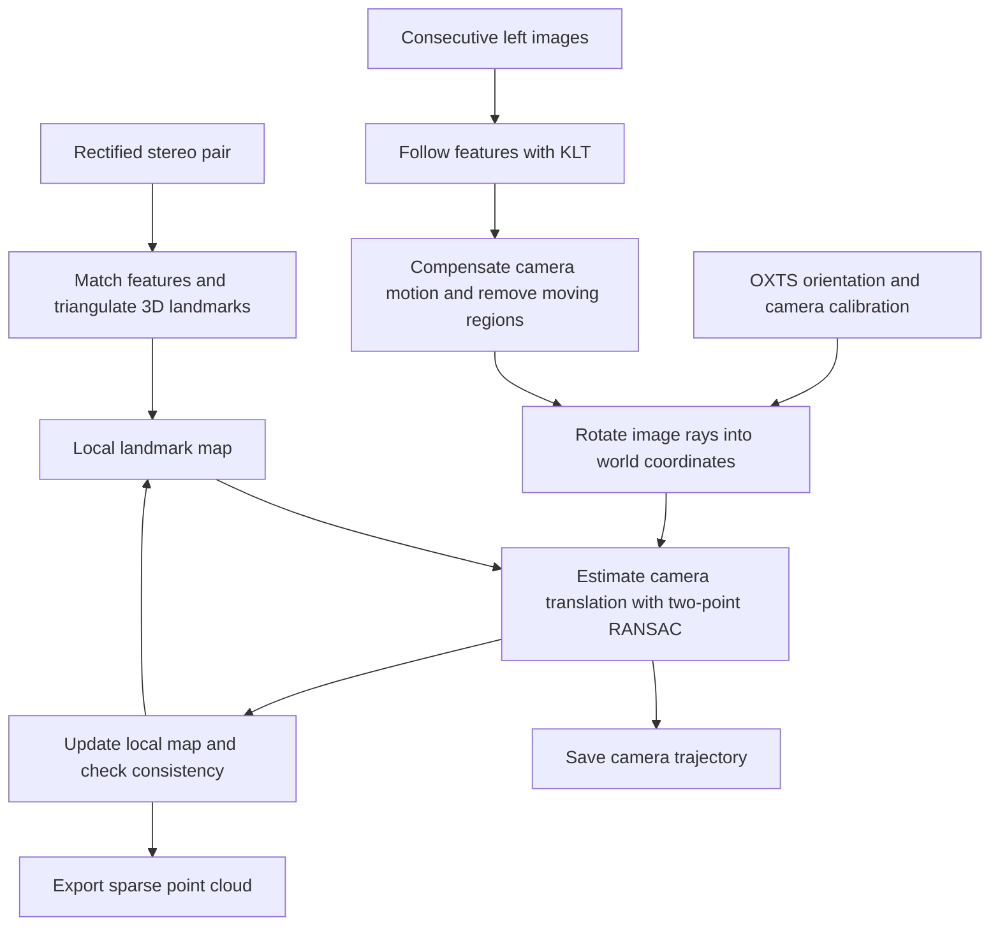

# Stereo + IMU SLAM with moving-feature removal

Estimate a moving camera's position and reconstruct a sparse 3D environment from stereo images and IMU orientation. This Python project implements the localization and reconstruction portions (Sections III-A/B) of **[A New Framework of Moving Object Tracking based on Object Detection-Tracking with Removal of Moving Features](https://thesai.org/Downloads/Volume11No4/Paper_6-A_New_Framework_of_Moving_Object_Tracking.pdf)**, by Ly Quoc Ngoc, Nguyen Thanh Tin, and Le Bao Tuan (IJACSA, 2020).

The implemented scope is visual localization and local mapping. Object detection and particle-filter object tracking are omitted. KLT image-feature tracking is included because localization needs to follow scene features between frames. There is no loop closure or global map optimization.

This is a research implementation reconstructed from the paper, not the authors' original code or a reproduction of its reported accuracy.

## Demo



KITTI Raw drive 0052: all 78 frames processed. The cyan arrow shows estimated camera position and heading; red regions are excluded from localization. Gray points show the final reconstructed map. This is playback of a recorded vehicle sequence.

## 1. Install

Run the commands below from the project root. Requirements: **Python 3.10+**, `curl` and `unzip` for the download commands, and **FFmpeg** for rendering playback videos.

```sh
python3 -m venv .venv
.venv/bin/python -m pip install -e '.[test]'
```

This installs NumPy, SciPy, headless OpenCV, and pytest. No GPU, GUI, or pretrained model weights are required. FFmpeg is a separate system executable; check that it is available before rendering:

```sh
ffmpeg -version
```

## 2. Download a small KITTI sequence

You only need **one drive and its calibration**, not the complete KITTI dataset. Start with drive **2011_09_26_drive_0052_sync**: 78 synchronized stereo pairs covering approximately 8 seconds.

| Download | Size | Contents |
| --- | --- | --- |
| [Drive 0052 — synced + rectified ZIP](https://s3.eu-central-1.amazonaws.com/avg-kitti/raw_data/2011_09_26_drive_0052/2011_09_26_drive_0052_sync.zip) | About 285 MB | Camera images, OXTS GPS/IMU packets, and other KITTI sensor data |
| [2011-09-26 calibration ZIP](https://s3.eu-central-1.amazonaws.com/avg-kitti/raw_data/2011_09_26_calib.zip) | About 4 KB | Stereo intrinsics and camera/IMU sensor calibration |

The archives come from KITTI's public storage. See the [official KITTI Raw page](https://www.cvlibs.net/datasets/kitti/raw_data.php) for dataset details and other drives. If a direct link is unavailable, use that page to access the corresponding synced drive and calibration.

Download and extract both archives into the same directory:

```sh
mkdir -p data/kitti

curl --fail --location --retry 3 \
  --output data/kitti/2011_09_26_drive_0052_sync.zip \
  https://s3.eu-central-1.amazonaws.com/avg-kitti/raw_data/2011_09_26_drive_0052/2011_09_26_drive_0052_sync.zip

curl --fail --location --retry 3 \
  --output data/kitti/2011_09_26_calib.zip \
  https://s3.eu-central-1.amazonaws.com/avg-kitti/raw_data/2011_09_26_calib.zip

unzip -n data/kitti/2011_09_26_drive_0052_sync.zip -d data/kitti
unzip -n data/kitti/2011_09_26_calib.zip -d data/kitti
```

This workspace already has these files downloaded and extracted. Skip the download step if the following layout is present:

```text
data/kitti/2011_09_26/
├── calib_cam_to_cam.txt
├── calib_velo_to_cam.txt
├── calib_imu_to_velo.txt
└── 2011_09_26_drive_0052_sync/
    ├── image_00/
    │   ├── timestamps.txt
    │   └── data/*.png            # Rectified left grayscale images
    ├── image_01/
    │   ├── timestamps.txt
    │   └── data/*.png            # Rectified right grayscale images
    └── oxts/
        └── data/*.txt            # Synchronized orientation packets
```

The drive archive also includes other sensor folders. This implementation uses only the grayscale stereo pair and OXTS orientation; it does not use LiDAR or GPS position.

Use **synced + rectified KITTI Raw** data. Isolated Stereo 2012 pairs are not a continuous SLAM sequence, and the odometry benchmark alone does not supply the orientations required by this method.

## 3. Run SLAM

Process the complete short drive:

```sh
.venv/bin/python -m mot_slam \
  data/kitti/2011_09_26/2011_09_26_drive_0052_sync \
  --output outputs/kitti_0052 \
  --save-masks
```

The runner estimates camera poses, updates its local map, and writes results to `outputs/kitti_0052`. Keep `--save-masks` enabled if you want the playback in the next step.

For a shorter check, add `--max-frames 25` and use a separate output directory. To run another KITTI Raw drive, replace the sequence path and provide its matching calibration. Calibration defaults to the drive's parent directory; `--calib-dir /path/to/calibration` overrides that location.

| Option | Purpose |
| --- | --- |
| `--max-frames 25` | Process only the first 25 frames |
| `--save-masks` | Save per-frame exclusion masks for inspection and playback |
| `--stereo-interval 25` | Refresh the stereo local map every 25 frames by default |
| `--motion-threshold 30` | Set the compensated intensity-difference threshold; lower values exclude more pixels |
| `--disable-moving-removal` | Compare against a run without image-based moving-region removal; RANSAC remains active |
| `--feature sift` | Default feature detector; `surf` requires a suitable custom OpenCV build |

Run `.venv/bin/python -m mot_slam --help` for all options. Output files with matching names are replaced, so use separate directories when comparing runs.

## 4. Watch the robot pose playback

After SLAM finishes, render the camera feed, exclusion masks, estimated path, and map:

```sh
.venv/bin/python examples/visualize_kitti.py \
  --data data/kitti/2011_09_26/2011_09_26_drive_0052_sync \
  --run outputs/kitti_0052
```

Open **[robot_demo.html](outputs/kitti_0052/robot_demo.html)** in a browser. On macOS:

```sh
open outputs/kitti_0052/robot_demo.html
```

The HTML contains the video and works offline. It includes replay and playback-speed controls. You can also open [the MP4](outputs/kitti_0052/robot_demo.mp4) or [the animated GIF](outputs/kitti_0052/robot_demo.gif). These links work after rendering; generated files are excluded from version control.

- **Camera feed:** the recorded KITTI vehicle view.
- **Red overlay:** image regions excluded from localization, including invalid warp borders. It is not an object-detection annotation.
- **Cyan arrow and line:** estimated camera heading, current position, and accumulated path.
- **Green dot:** the starting position.
- **Gray points:** the final reconstructed cloud from the complete run. The path animates over time; the cloud is not a live map-growth display.

The playback shows estimated motion from a recorded vehicle sequence; it does not control a physical robot. Playback axes are relative to the first camera, with rightward x and forward z viewed from above. Timing uses the recording's average frame interval. The supplied visualizer is configured and labeled for drive 0052.

## How it works



1. **Build an initial map from stereo.** Match recognizable image features between the left and right cameras. Their horizontal pixel displacement (disparity), together with the calibrated baseline, gives metric depth: `depth = fx × baseline / disparity`.
2. **Follow features through time.** KLT optical flow finds where those features appear in the next left image. A forward/backward check rejects unreliable matches.
3. **Remove moving regions.** Estimate a homography between consecutive images, warp the previous image into the current image coordinates, and subtract their intensities. Thresholding and morphology produce an exclusion mask. Features inside that mask do not contribute to camera localization.
4. **Use IMU orientation to solve camera position.** Calibration converts the OXTS orientation into the left camera's orientation. Because rotation is known, the solver estimates only the three translation coordinates. Two-point RANSAC rejects observations inconsistent with a static scene, then refits the position using the accepted observations.
5. **Maintain the local map.** Remove lost or rejected features, triangulate suitable observations across time, and refresh landmarks from stereo periodically. A comparison between monocular and stereo landmark ranges can trigger an earlier stereo refresh.
6. **Export results.** Save the camera poses, diagnostics, and a sparse historical cloud of confirmed landmarks. The map contains sampled feature points, not a dense mesh.

## Outputs and coordinate conventions

| File | Meaning |
| --- | --- |
| `trajectory.tum` | `time tx ty tz qx qy qz qw`; camera-to-world orientation, origin at the first camera center, world axes from OXTS |
| `poses.txt` | One row-major 3×4 camera-to-world matrix per frame, relative to the first camera frame; KITTI pose format |
| `map.ply` | Sparse XYZ cloud in meters, using the same world frame as `trajectory.tum` |
| `diagnostics.csv` | Frame names, landmark counts, translation inliers, median reprojection error, refresh events, and range-ratio consistency |
| `masks/*.png` | Optional current-image exclusion masks; white means excluded |
| `robot_demo.html`, `.mp4`, `.gif` | Playback artifacts created by the visualization script |

Inputs are matched by frame filename within a synced drive. Timestamps are elapsed seconds from the first left image. The loader does not synchronize unprocessed streams or interpolate asynchronous IMU data.

The orientation conversion is:

```text
R_camera_imu = R_rect_00 @ R_cam_velo @ R_velo_imu
R_world_camera = Rz(yaw) @ Ry(pitch) @ Rx(roll) @ R_camera_imu.T
X_world = R_world_camera @ X_camera + camera_position_world
```

OXTS roll/pitch/yaw comes from KITTI's integrated navigation system. The code does not integrate raw gyroscope or accelerometer samples and does not use latitude/longitude for translation. Camera/IMU calibration translations are unnecessary for estimating the left camera center itself, but an evaluation against IMU/GPS position must account for the offset between those sensors.

If localization fails, the runner exits with code 2 and saves the valid trajectory prefix. Stereo map refresh is local recovery while a pose is still available; it is not global relocalization after losing the camera pose.

## Custom camera inputs

Use `--camera-json /path/to/camera.json --orientations /path/to/orientations.csv` with rectified stereo images in the same directory layout. Images must be undistorted, horizontally rectified, and share intrinsics.

The JSON contains `fx`, `fy`, `cx`, `cy`, and `baseline` in meters. The CSV columns are `frame,timestamp,qx,qy,qz,qw`, with one row per image filename, strictly increasing timestamps in seconds, and **rectified camera-to-world** quaternions. Compose raw IMU-to-world quaternions with the camera-to-IMU calibration before providing them.

## Implementation and differences

| Paper component | Implementation |
| --- | --- |
| Stereo feature matching | SIFT + FLANN + Lowe ratio, unique right-image matches and epipolar checks; `vision.py` |
| KLT feature propagation | Pyramidal Lucas–Kanade with forward/backward consistency |
| Moving-feature removal | RANSAC homography, camera-motion compensation, thresholded background difference, morphology; masks align to the current frame |
| Stereo depth | Metric triangulation using positive horizontal disparity and separate fx/fy; `geometry.py` |
| Eq. (8–11) translation | IMU-rotated unit bearings; 3×3 weighted linear solve inside two-point RANSAC; consensus refit with positive-depth checks |
| Eq. (12–13) map maintenance | Temporal ray triangulation with minimum parallax, cheirality and reprojection checks |
| Eq. (14) recovery | Mean monocular/stereo range ratio for corresponding anchored landmarks; refresh when it differs from 1 by more than the tolerance |
| Periodic local map | Stereo refresh every 25 frames by default, with earlier replenishment if too few landmarks remain |

Practical choices are explicit:

- SIFT replaces SURF by default. `--feature surf` selects SURF if OpenCV was built with `OPENCV_ENABLE_NONFREE`; typical prebuilt wheels cannot instantiate SURF.
- The homography is robustly estimated with normalized projective geometry through OpenCV, rather than using the paper's simplified matrix formula. Warping direction is reversed consistently so masks can be sampled directly at current feature locations.
- Signed horizontal disparity replaces Euclidean image-point distance, appropriate for rectified stereo and permitting rejection of reversed correspondences.
- The translation solver follows the **printed Eq. (11)** weighting `1/d`. Differentiating Eq. (10) literally would instead produce `1/d²`; this ambiguity is not silently changed.
- Two-point RANSAC uses a configurable iteration budget and pixel reprojection threshold. Invalid and ill-conditioned samples are rejected.
- Temporal triangulation updates existing points only with adequate parallax and adds newly detected features when the map is sparse. Stereo reference positions are retained separately for the range-ratio check. Low-parallax feature depletion can trigger an early stereo refresh.
- New stereo points must survive a later motion/pose-consensus check before cloud export. First-frame motion is unobservable. The exported historical cloud is voxel-filtered and may retain points from objects that move after they were archived.
- Unspecified thresholds are exposed in `Config` (`mot_slam/pipeline.py`); their defaults are engineering choices. No real-time performance claim is made.

A single homography only approximates camera-induced motion in a general 3D scene. Parallax, lighting changes, shadows, and moving objects dominating the image can cause incorrect masks and localization loss. Inspect saved masks; adjust `--motion-threshold` or compare `--disable-moving-removal` (RANSAC still runs). This limitation belongs to the method, and the code does not replace it with semantic detection.

## Python API

```python
import numpy as np
from mot_slam import Camera, Config, StereoIMUSLAM

camera = Camera(fx=700., fy=700., cx=600., cy=180., baseline=.54)
slam = StereoIMUSLAM(camera, Config(stereo_interval=25))
# left/right: uint8 rectified images; R_wc: calibrated camera-to-world rotation.
# result = slam.process(left, right, R_wc, timestamp=0.0)
# camera_position = result.position
# sparse_world_points = slam.map_points()
```

## Validation and limitations

Tests exercise metric depth, nonidentity IMU rotation, translation with moving outliers, degenerate geometry, temporal triangulation, compensated masks and warp borders, KITTI calibration/timestamps, and pose export conventions. The downloaded KITTI Raw drive 0052 completed all 78 frames without localization loss. Its data and playback outputs are excluded from version control. Ground-truth KITTI accuracy and long-run robustness remain to be evaluated.

Run the checks with:

```sh
.venv/bin/python -m pytest -q
```

The current suite has 8 tests. The completed KITTI 0052 run produced 78 valid poses and an estimated path length of approximately 8.25 m. Successful completion and low reprojection error are not ground-truth position accuracy measurements. This implementation does not provide loop closure, global bundle adjustment, dense reconstruction, or raw-IMU state estimation.

## Code layout

| File | Responsibility |
| --- | --- |
| `mot_slam/geometry.py` | Projection, triangulation, and known-rotation translation estimation |
| `mot_slam/vision.py` | Feature detection/matching, KLT flow, and moving-region masks |
| `mot_slam/pipeline.py` | Localization state, landmark maintenance, and stereo refresh |
| `mot_slam/io.py` | KITTI calibration/OXTS loading and result export |
| `mot_slam/cli.py` | Command-line runner |
| `examples/visualize_kitti.py` | KITTI camera/path playback rendering |
| `tests/` | Geometry, filtering, failure handling, calibration, and export checks |
